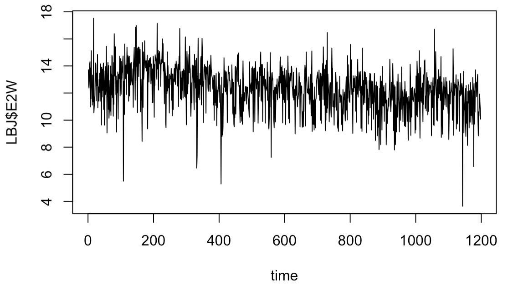

## Welcome to GitHub Pages

You can use the [editor on GitHub](https://github.com/macqian/Stat-153-Blog-Post/edit/master/README.md) to maintain and preview the content for your website in Markdown files.

Whenever you commit to this repository, GitHub Pages will run [Jekyll](https://jekyllrb.com/) to rebuild the pages in your site, from the content in your Markdown files.

### Markdown

Markdown is a lightweight and easy-to-use syntax for styling your writing. It includes conventions for

```markdown
Syntax highlighted code block

# Header 1
## Header 2
### Header 3

- Bulleted
- List

1. Numbered
2. List

**Bold** and _Italic_ and `Code` text

[Link](url) and 
```

For more details see [GitHub Flavored Markdown](https://guides.github.com/features/mastering-markdown/).

### Jekyll Themes

Your Pages site will use the layout and styles from the Jekyll theme you have selected in your [repository settings](https://github.com/macqian/Stat-153-Blog-Post/settings). The name of this theme is saved in the Jekyll `_config.yml` configuration file.


## Lebron James and Effort to Win

For the past 15 years, Lebron James has been one of the most dominant and recognized sports figures across the globe. The question we had was: exactly how hard did Lebron have to try in order to win basketball games? To find out, we used a new metric called “Effort to Win” (E2W) that measures the physical effort he exerted every game since his rookie season, and using that metric, we will forecast what his E2W will be for the first 10 games of the 2019-2020 NBA season. 



Looking at the chart above, we see Lebron has an **average E2W score of around 12** across his career thus far. However, there are two aspects of the graph that are concerning. First, the data itself follows a sinusoidal pattern, moving up and down as time increases. This creates variance, which for our situation, will be detrimental in creating accurate forecasts. Second, there are these large spikes that occur randomly throughout the time series. We hypothesize the reason for these spikes is because towards the end of each season, teams already know what their playoff seeding will be, so players like Lebron either take it easy or try extra hard for the last few games. 

To remove these two issues, we pursued many different statistical techniques and models. For instance, we tried modeling the data using a sinusoidal model that mimiced the up and down pattern to see if we can discover any trends that will help with our forecasts. We ultimately settled on a technique called _differencing_ , which measures the change in Lebron’s E2W from game t to game t + i where i denotes _lag_ or how far apart the games are from each other. In this case, we set i = 1, or just the change in E2W from one game to the next. We then created a time series plot and a ACF plot (which measures the correlation from game t and game t + i) using this new dataset to determine its fit. 


Looking at the new time series plot, the sinusoidal problem seems to be gone as there is a constant mean around 0. However, the spikes are still there, so we need to apply another statistical adjustment in order to account for them. We see in the ACF plot that there are two large spikes that fall outside the blue confidence intervals, one at lag 0 and one at lag 1. The lag 0 spike will always be there as a data point at time t will always have a correlation of 1 with itself. The spike at lag 1 tells us that the data set can most likely be fitted by a **moving average (MA) model**, specifically an **MA(1) model** as there is the large spike at lag 1. Using this final model, we arrive at our forecasts.


Looking at the forecasts (denoted by the new red points), it seems Lebron James will have a E2W score of around 11 for the first 10 games. At first glance, this might appear weird as his past E2W scores follow a cyclical pattern with the E2W score moving up and down from game to game. However, our model is not predicting exactly what his E2W score will be, but more so what the model believes his E2W score will be around given the past. As a result, our model claims his E2W score will average out to be around 11 for the next 10 games. It's also important to note that there appears to be a slightly downward trend in the forecast, with each point being slightly lower than the one before it. We surmise this trend occurs due to Lebron's increasing age. He is currently 35, well past a basketball player's prime, so it makes sense for him to preserve his body so he can player longer. As a result, the effort he invests into a game will decrease as time goes on. This claim is supported by the fact that when we look at the original data from before, his average E2W score hovers around 12, but our forecasts hover around 11. 

Overall, the Effort to Win metric encompasses the physical effort a player puts into a game to help his team get a win. Using our model, we tried to account for factors like importance of game, when the game is in the season, and Lebron's physical condition. Ultimately though, it's important to remember Statistician George Box's famous quote: "All models are wrong, but some are useful". Our model will not perfectly predict exactly how hard Lebron will try, but we hope it will serve as a helpful guide to determine his Effort to Win score for the upcoming NBA season.
